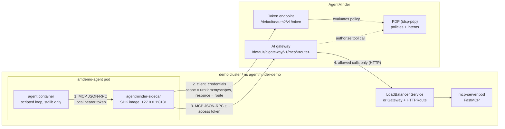
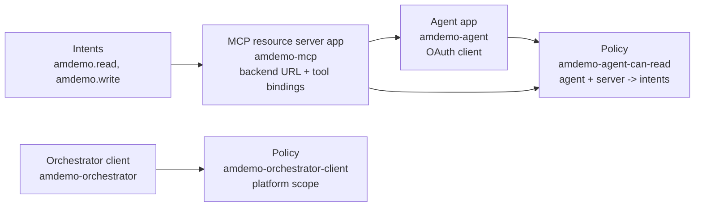
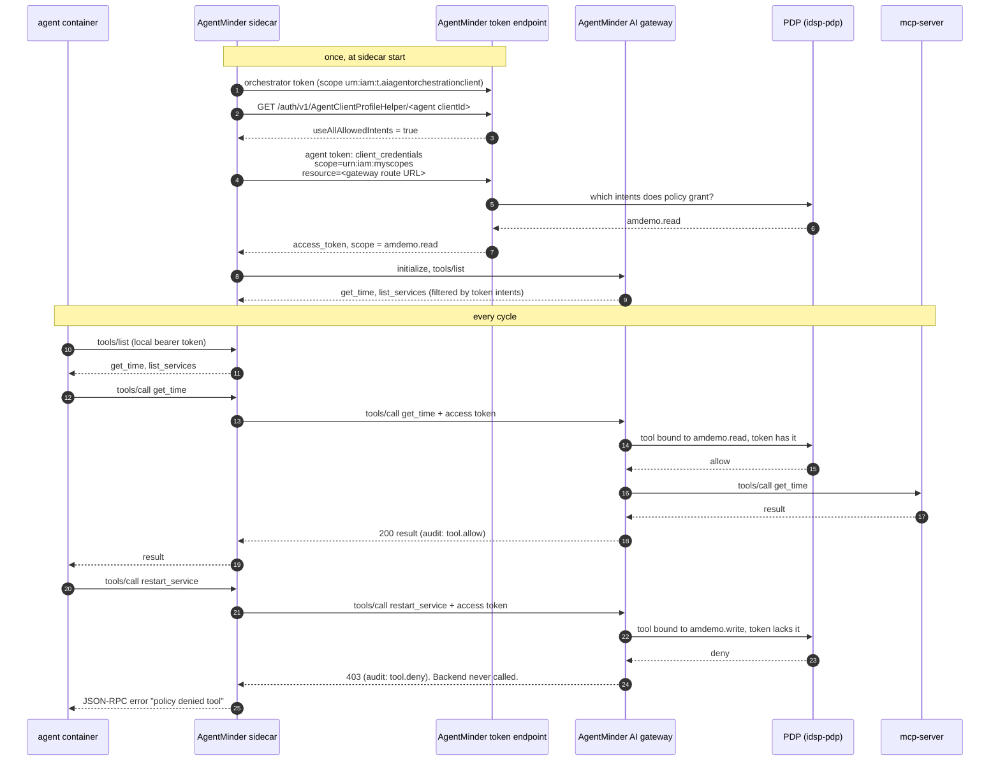

# How AgentMinder works, through the amdemo demo

AgentMinder decides, per tool call, whether an AI agent may use an MCP tool.
It sits in the request path as both the OAuth authorization server and an MCP
gateway, so the agent never talks to the MCP server directly. This demo shows
that loop with one scripted agent, one three-tool MCP server and one policy,
all deployed by a single `ansible-playbook site.yml` run.

What it shows, on AgentMinder `4.1.1`:

- The agent holds no AgentMinder credentials. The AgentMinder sidecar in its
  pod gets a token that carries only the **intents** a policy grants.
- The gateway filters `tools/list` to the tools those intents cover, and
  blocks `tools/call` on the rest with HTTP 403.
- Changing the policy (granting or revoking `amdemo.write`) changes what the
  agent can do on its next token. The agent code and the MCP server do not
  change.
- Every allow and deny is written to the gateway audit log with the agent,
  tool, intent and decision.

The agent has no LLM. Every 60 seconds it lists tools and calls `get_time`,
`list_services` and `restart_service`, so the allow/deny behavior is easy to
see.

## Contents

1. [Architecture](#architecture)
2. [Object model](#object-model)
3. [Runtime flow](#runtime-flow)
4. [Grant and revoke](#grant-and-revoke)
5. [Admin API used by the modules](#admin-api-used-by-the-modules)
6. [Automation](#automation)
7. [Networking](#networking)
8. [Security notes and gaps](#security-notes-and-gaps)

## Architecture



| Component | Where | What it does |
|---|---|---|
| `agent` container | `amdemo-agent` pod | Posts `tools/list` and `tools/call` to the sidecar and logs ALLOWED/DENIED. Knows only the sidecar URL and a local bearer token. |
| `agentminder-sidecar` container | `amdemo-agent` pod | AgentMinder SDK (`uvicorn agentminder.sidecar:app`). Holds the agent and orchestrator client credentials, gets tokens, keeps the MCP session and forwards calls to the gateway. Listens on loopback only. |
| AgentMinder token endpoint | AgentMinder | Issues OAuth tokens. Puts only policy-granted intents in the token's `scope`. |
| AgentMinder AI gateway | AgentMinder | MCP proxy. Checks the token, filters `tools/list`, authorizes each `tools/call` against tool bindings and policy, forwards allowed calls. |
| `mcp-server` | demo cluster, `agentminder-demo` | Plain FastMCP server with three tools. Does no auth of its own. |
| LoadBalancer Service, or Gateway + HTTPRoute | demo cluster | Gives the MCP server an address the AgentMinder gateway can reach. |

The MCP server does not authenticate callers. All of the security is in the
AgentMinder gateway. Anything that can reach its address directly can call
the MCP server, so in a real deployment the backend should only accept
traffic from the gateway.

## Object model

AgentMinder needs five objects for this demo. They depend on each other in
this order, which is also the order the playbook creates them:



### Intents

An intent is a named permission, stored in the tenant's intent catalog
(`/admin/v1/AgentIntentCatalog`). By itself it grants nothing. Its OAuth scope
form is `urn:iam:agent:intent:<name>`. The catalog `name` has no URN prefix.

| Intent | Risk | Covers |
|---|---|---|
| `amdemo.read` | normal | `get_time`, `list_services` |
| `amdemo.write` | elevated | `restart_service` |

### MCP resource server app

An app with `isResourceServerApp: true` and `isAiResourceServerApp: true`. It
represents one MCP backend and holds:

| Field | Demo value | Meaning |
|---|---|---|
| `mcpServerEndpoint` | `http://mcp.example.com/mcp` | Where the gateway forwards allowed calls |
| `primaryAudience` | the gateway route URL | Token audience for this server |
| `resourceServerScopes` | both intents, with risk | Intents this server understands |
| `agentToolBindings` | one entry per tool | Maps each MCP tool name to the intent that unlocks it |
| `enforcePolicies` | `true` | Gateway evaluates policy on each call |
| `protectedByDefault` | `true` | A tool with no binding cannot be called |
| `mcpRequireAccessToken` | `true` | `tools/call` needs a Bearer token |
| `mcpDiscoverRequireAccessToken` | `true` | `initialize` and `tools/list` need one too |
| `mcpRequireIntentToken` | `false` | Not using intent tokens or missions in this demo |
| `mcpIgnoreSslValidation` | `true` | Backend is plain HTTP anyway |

AgentMinder generates a gateway route for the app:
`https://agentminder.example.com/default/aigateway/v1/mcp/<base64(appId)>`,
base64 with the `=` padding removed. Agents connect to that URL, never to
`mcpServerEndpoint`.

Tool bindings look like this on the app:

```json
"agentToolBindings": [
  {"toolName": "get_time",        "intentScope": "urn:iam:agent:intent:amdemo.read",  "source": "MANUAL"},
  {"toolName": "list_services",   "intentScope": "urn:iam:agent:intent:amdemo.read",  "source": "MANUAL"},
  {"toolName": "restart_service", "intentScope": "urn:iam:agent:intent:amdemo.write", "source": "MANUAL"}
]
```

### Agent app

An app with `isAgentApp: true`. It is an OAuth confidential client that uses
the `client_credentials` grant. The fields that matter:

| Field | Demo value | Meaning |
|---|---|---|
| `agentDelegationMode` | `AUTONOMOUS` | Acts as itself, not on behalf of a user in a mission |
| `agentRiskLevel` | `standard` | Risk label, available to policy |
| `agentUseAllAllowedIntents` | `true` | The sidecar asks for no specific intents; the token carries every intent a policy grants |

An app has two IDs. `appId` is the internal ID that policies use. `clientId`
is the OAuth client ID the agent authenticates with. Mixing them up is the
easiest mistake to make with policies.

### Orchestrator client

The SDK sidecar needs a second identity next to the agent's. It uses it for
control-plane calls: reading the agent's profile, and creating missions when
missions are in use. The agent's own token cannot make those calls
(`401 Unprivileged access token`).

The orchestrator is a plain confidential client, not an agent app
(`isAgentApp: false`, `client_credentials` only). What makes it an
orchestrator is a policy on the platform's own app, `SSP`, that grants it the
scope `urn:iam:t.aiagentorchestrationclient`:

```json
{
  "policyName": "amdemo-orchestrator-client",
  "policySubType": "role",
  "apps": [{"id": "<SSP appId>", "name": "SSP"}],
  "rules": [{
    "conditions": {"principal": {"clientApp": {"operator": "in", "value": ["<amdemo-orchestrator appId>"]}}},
    "result": {"effect": "grant", "privileges": ["urn:iam:t.aiagentorchestrationclient"]}
  }]
}
```

`SSP` is not listed under `/admin/v1/Apps`. Its ID appears in the `apps`
field of the built-in policies. The orchestrator must ask for the scope
explicitly (`AGENTMINDER_ORCHESTRATOR_SCOPES`). Until the policy takes effect,
a few seconds after it is created, the token endpoint answers
`400 Invalid scope`.

### Policy

A native `role` policy (`/admin/v1/AuthZPolicies`). It is scoped to one
resource server through `apps`, and one grant rule says which agents get which
intents:

```json
{
  "policyName": "amdemo-agent-can-read",
  "policySubType": "role",
  "status": "active",
  "matchAnyApp": false,
  "apps": [{"id": "<amdemo-mcp appId>", "name": "amdemo-mcp"}],
  "rules": [{
    "conditions": {"principal": {"clientApp": {"operator": "in", "value": ["<amdemo-agent appId>"]}}},
    "result": {"effect": "grant", "msg": "amdemo-agent-can-read",
               "privileges": ["urn:iam:agent:intent:amdemo.read"]}
  }]
}
```

Granting write access means adding `urn:iam:agent:intent:amdemo.write` to
`privileges`. Nothing else changes.

## Runtime flow

One agent cycle with the default policy (read only):



### 1. Agent to sidecar

The agent posts plain MCP JSON-RPC to `http://127.0.0.1:8181/mcp` with
`Authorization: Bearer <AGENTMINDER_SIDECAR_TOKEN>`. That token is a shared
local secret; the sidecar refuses to start without it. The agent needs no
`initialize`, session ID or protocol version. The sidecar supports
`initialize`, `tools/list` and `tools/call`, and answers a denied call with
HTTP 200 and a JSON-RPC error.

Other sidecar endpoints: `GET /healthz` (no auth), `GET /info` (SDK, server
and resource report), `GET /mission`, `POST /mission/renew`, and
`/proxy/<path>` for raw HTTP with credentials added.

Sidecar settings used here:

| Variable | Value |
|---|---|
| `AGENTMINDER_IDSP_URL` | `https://agentminder.example.com/default` |
| `AGENTMINDER_SIDECAR_TOKEN` | local bearer token shared with the agent |
| `AGENTMINDER_SIDECAR_AGENT_CLIENT_ID` / `_CLIENT_SECRET` | the agent app's client |
| `AGENTMINDER_ORCHESTRATOR_CLIENT_ID` / `_CLIENT_SECRET` | the orchestrator client |
| `AGENTMINDER_ORCHESTRATOR_SCOPES` | `urn:iam:t.aiagentorchestrationclient` |
| `AGENTMINDER_SIDECAR_RESOURCE_0_NAME` / `_URL` / `_AUDIENCE` | `amdemo-mcp` and the gateway route URL |
| `AGENTMINDER_CA_BUNDLE` | CA file for the AgentMinder certificate |

`AGENTMINDER_SIDECAR_MISSION_TYPE` is not set, so no mission is created.

### 2. Token request

With no mission, the sidecar reads the agent's profile with the orchestrator
token. Because the agent has `useAllAllowedIntents: true`, it then asks for
the scope `urn:iam:myscopes`, which AgentMinder resolves to every intent a
policy grants this agent on this resource:

```
POST https://agentminder.example.com/default/oauth2/v1/token
Content-Type: application/x-www-form-urlencoded

grant_type=client_credentials
&client_id=<agent clientId>&client_secret=<agent secret>
&resource=https://agentminder.example.com/default/aigateway/v1/mcp/<route>
&scope=urn:iam:myscopes
```

Notes on this request:

- **`resource` (RFC 8707) is required.** Without it, `urn:iam:myscopes` or
  any intent scope yields no intents (`urn:iam:m.meclient` only), and naming
  an intent scope returns `400 invalid_request "Invalid scope"`. `audience=`
  does not work in its place. `resource` tells AgentMinder which resource
  server's policies apply.
- **Do not add `openid`** to the scope. The request fails.
- **If the profile cannot be read, the sidecar asks for no scopes.** The token
  then carries no intents and `tools/list` comes back empty. That is what
  happens without a working orchestrator client.
- A client can also name intents itself
  (`scope=urn:iam:agent:intent:amdemo.read ...`). Intents the policy does not
  grant are dropped silently.
- The token's `aud` is `[<gateway route URL>, https://agentminder.example.com/default/]`.
- **The sidecar keeps the token until it expires** (one hour). See
  [Grant and revoke](#grant-and-revoke).

### 3. MCP session through the gateway

The sidecar speaks MCP over streamable HTTP (JSON-RPC in a POST body) to the
gateway route, with the token as a Bearer header.

- **The gateway only accepts MCP protocol versions `2025-06-18` and
  `2025-11-25`.** `2025-03-26` or `2024-11-05` returns HTTP 200 with a
  JSON-RPC error: `{"code":2003,"message":"AI Gateway: Backend does not
  support a compatible protocol version"}`, even when the backend accepts
  those versions directly. The sidecar uses `2025-06-18`.
- The gateway returns its own `Mcp-Session-Id`, a signed JWT that records the
  backend URL and capabilities. The sidecar sends it back on each later call.

### 4. Filtered tool discovery

`tools/list` passes through to the backend, but the gateway removes tools the
token's intents do not cover. With read-only access the agent sees
`['get_time', 'list_services']`. `restart_service` is not listed at all. The
sidecar lists tools once per session and serves later `tools/list` calls from
that copy.

### 5. Per-call authorization

For each `tools/call` the gateway looks up the tool's binding, takes the
bound intent, and asks the PDP whether this agent holds it for this resource
server.

- **Allow:** the call is forwarded to `mcpServerEndpoint` and the result is
  returned. Audit event `aigateway.mcp.tool.allow`.
- **Deny:** `403`, the backend is never called. Audit event
  `aigateway.mcp.tool.deny`.

The demo agent calls `restart_service` even though `tools/list` hid it. A real
agent would not, but the call proves the gateway enforces, not just hides.

Deny logs carry the reason from the PDP:

```
authorize: request denied for sub=<agent clientId> by PDP "idsp-pdp"
reason: Computed allowed scopes '[]' does not contain requested scopes: '[urn:iam:agent:intent:amdemo.write]'
MCP: tool call "restart_service" denied on backend "amdemo-mcp": policy/authorize
```

`authorize` is the gateway's own authorization step reporting "no policy
granted this". It is not a policy you created.

## Grant and revoke

A policy change applies to **new tokens**. Two delays matter:

- AgentMinder takes up to about a minute to apply a policy change at the
  token endpoint.
- The sidecar keeps its token for the token's lifetime (one hour), so a
  running agent keeps its old intents until then.

The playbook handles both. After changing the policy it waits until a fresh
token for the agent carries exactly `granted_intents`
(`agentminder_token`), then restarts the agent pod so the sidecar starts with
a new token.

| Step | Policy grants | Token scope | `tools/list` | `restart_service` |
|---|---|---|---|---|
| start | `amdemo.read` | read | `get_time`, `list_services` | DENIED |
| grant `amdemo.write` | `amdemo.read`, `amdemo.write` | read + write | all three | ALLOWED, `restarted cache` |
| revoke `amdemo.write` | `amdemo.read` | read | `get_time`, `list_services` | DENIED |

To reproduce, from `ansible/`:

```bash
# grant write
ansible-playbook site.yml \
  -e '{"granted_intents": ["amdemo.read", "amdemo.write"]}'

# revoke: re-run with the defaults
ansible-playbook site.yml

# watch the agent
kubectl -n agentminder-demo logs deploy/amdemo-agent -c agent -f

# gateway audit trail, on the AgentMinder cluster (names depend on the install)
kubectl -n ssp logs deploy/ssp-ssp-aigateway -c ssp-aigateway --since=10m \
  | grep -E 'MCP: tool call|request denied'
```

The gateway logs JSON lines. The allow event after the grant shows the
intent that unlocked the call:

```json
{"msg": "MCP: tool call \"restart_service\" allowed on backend \"amdemo-mcp\"",
 "eventId": "aigateway.mcp.tool.allow",
 "relVersion": "4.1.1.1673",
 "idsp.policy.decision": "allow",
 "idsp.intent.scope": "urn:iam:agent:intent:amdemo.write",
 "idsp.intent.name": "amdemo.write",
 "gen_ai.agent.name": "amdemo-agent",
 "gen_ai.tool.name": "restart_service",
 "mcp.method.name": "tools/call",
 "mcp.protocol.version": "2025-06-18",
 "aigateway.mcp.duration": "3.516223ms"}
```

`relVersion` on every audit event is the quickest way to confirm which build
the gateway runs.

## Admin API used by the modules

All paths are under `https://agentminder.example.com/<tenant>`, here
`/default`.

### Authentication

`client_credentials` against `/oauth2/v1/token`, with HTTP Basic client auth
and these scopes:

```
urn:iam:t.apps urn:iam:t.authzpolicies urn:iam:t.aigateways
urn:iam:t.airesources urn:iam:t.airesourceservers
```

The scopes must be requested explicitly. A token request with no `scope`
succeeds but only carries `urn:iam:m.meclient`, not the admin scopes.

The client ID and secret come from `local.yml`
(`agentminder_client_id`, `agentminder_client_secret`), with the CA in
`agentminder_ca_file`. On a default install the tenant bootstrap client is in
secret `ssp-ssp-secret-defaulttenantclient` and the CA is `ca.crt` in secret
`ssp-ssp-tls`, both in namespace `ssp`. That CA is a bare self-signed cert,
so clients need `VERIFY_X509_PARTIAL_CHAIN` (Python) to trust it as an anchor.

### Endpoints

| Object | Call | Notes |
|---|---|---|
| Intent | `GET/POST /admin/v1/AgentIntentCatalog` | `name` without URN prefix. Bulk ops: `?op=bulkAdd\|bulkCheck\|bulkRemove` |
| Intent | `PUT/DELETE /admin/v1/AgentIntentCatalog/{agentIntentTypeId}` | |
| App | `GET /admin/v1/Apps` | Lists all apps, **including client secrets in plain text** |
| App | `POST /admin/v1/Apps` | Payload mirrors the console's `createApplication` (`apptype_agent` / `apptype_mcp_server` presets) |
| App | `GET /admin/v1/Apps/{appId}?resolveMetadataObjIds=true` | Full object |
| App | `PUT /admin/v1/Apps/{appId}?resolveMetadataObjIds=true` | Full-object replace. Drop `secret`, `createdBy`, `updatedBy`, `createdDateTime`, `updatedDateTime` first |
| App | `DELETE /admin/v1/Apps/{appId}?force=true` | Returns `500` for a few minutes for a client that recently held a platform scope; retry |
| Tool bindings | `agentToolBindings` field on the app, written with the app `PUT` | Readable on its own via `AgentToolBindingsHelper?appId=` |
| Policy | `GET /admin/v1/AuthZPolicies?filter=(policyName eq <name>)` | |
| Policy | `POST /admin/v1/AuthZPolicies`, `PUT/DELETE .../{policyId}` | Server adds rule IDs; ignore them when comparing. The same shape, targeting app `SSP`, grants platform scopes such as `urn:iam:t.aiagentorchestrationclient` |
| Agent profile | `GET /auth/v1/AgentClientProfileHelper/{clientId}` | Called by the sidecar, not the modules. Needs `urn:iam:t.aiagentorchestrationclient` or `urn:iam:t.airesources` |
| Token | `POST /oauth2/v1/token` | `agentminder_token` uses it to read back granted scopes |
| Gateway routes | `GET .../AIGateways/groups/default/routes` (exact prefix not recorded) | Summaries only. `.../routes/{name}` returned 404 `Unknown gateway route` |

## Automation

One playbook, three custom modules, no images to build.

```
ansible/
  site.yml
    tasks/preflight.yml    check that the AgentMinder settings are present
    tasks/mcp_server.yml   MCP server + its exposure on the demo cluster
    tasks/agentminder.yml  intents -> resource server -> agent -> orchestrator -> policies
    tasks/agent.yml        registry login, Secret, ConfigMap, Deployment (agent + sidecar)
  teardown.yml             reverse of the above
  plugins/modules/         agentminder_intent, agentminder_app, agentminder_policy, agentminder_token
  plugins/module_utils/    agentminder.py (shared admin API client)
  inventory/group_vars/all/defaults.yml, local.yml
app/                       agent.py, mcp_server.py
```

| Module | Manages | Notes |
|---|---|---|
| `agentminder_intent` | One catalog intent | |
| `agentminder_app` | `type: agent`, `type: orchestrator` or `type: mcp_server` | Creates with `POST`, then converges only the managed fields with a full-object `PUT`, then re-reads and fails if they did not converge. Returns `app_id`, `client_id`, `gateway_url`, optionally `client_secret` |
| `agentminder_policy` | One `role` policy with one grant rule | Takes app **names** and resolves them to `appId`s. Grants intents on a resource server, or platform scopes on `SSP` |
| `agentminder_token` | Nothing; read-only | Returns the scopes and intents a client is granted. Used with `until` to wait for a policy change |

Design choices:

- **Standard library only.** The modules and the agent use `urllib`, so they
  need no extra Python packages. The MCP server installs `mcp>=1.12,<2` at
  pod start into `/tmp/deps`.
- **Idempotent with check mode.** Each module compares only what it manages,
  ignoring server-added keys and order. A second `site.yml` run reports
  `changed=0`.
- **Settings in one file.** The AgentMinder URL, admin client, CA and
  registry login are set in the git-ignored `local.yml`. The agent and
  orchestrator client secrets are returned by `agentminder_app` under
  `no_log` and go into a Kubernetes Secret on the demo cluster.
- **Waits instead of sleeps.** AgentMinder applies policy changes after a
  short delay. The playbook polls with `agentminder_token` until the
  orchestrator holds its scope and until agent tokens match
  `granted_intents`, so the sidecar never starts with a stale token.
- **Code from ConfigMaps.** The agent and the MCP server run stock
  `python:3.12-slim` with the code mounted from a ConfigMap. The sidecar
  runs the AgentMinder SDK image unchanged. All containers run as non-root
  with all capabilities dropped, so the pods pass Pod Security `restricted`.
  Checksum annotations restart the agent pod when the code, sidecar
  settings, credentials or granted intents change.
- **Tags.** `mcp` runs the MCP server only, `agentminder` adds the
  registration, `agent` runs everything.

## Networking

The AgentMinder gateway must reach the MCP server, so the MCP server needs an
address that is routable and resolvable from wherever AgentMinder runs.
`mcp_expose` picks how:

- `loadbalancer` (default): a `LoadBalancer` Service. The playbook waits for
  its address and registers `http://<address>/mcp`.
- `gateway`: a Gateway API `Gateway` and `HTTPRoute`. The playbook waits for
  the Gateway address, sets a hostname on the listener and route
  (`mcp_hostname`, or an `sslip.io` name derived from the address), and
  registers `http://<hostname>/mcp`.
- `clusterip`: no external address. Only for AgentMinder on the same cluster.

The agent needs no inbound path. It only calls the AgentMinder URL.

For Avi (AKO) with Istio, see [avi-ako-notes.md](avi-ako-notes.md).

## Security notes and gaps

- **The admin client is effectively a master key.** `GET /admin/v1/Apps`
  returns every app's client secret in plain text. The demo uses the tenant
  bootstrap client, kept in a git-ignored file. A dedicated, narrowly scoped
  admin client would be better.
- **The orchestrator secret sits in the agent pod.** The sidecar needs it,
  and its scope covers agent orchestration for the tenant, not only this
  agent. Keep it in the sidecar container only; the agent container gets
  just the local sidecar token.
- **Revoking an intent does not cut off a running sidecar.** It keeps its
  token for up to an hour. Restart the agent pod to apply a revoke at once;
  the playbook does this.
- **The MCP backend is unauthenticated.** The gateway enforces policy, but
  its load balancer address is reachable directly. Restrict the backend to
  gateway traffic in anything beyond a demo.
- **Backend traffic is plain HTTP** from the gateway to the MCP server
  address (`mcpIgnoreSslValidation: true`).
- **Not covered:** missions and delegated agents
  (`agentDelegationMode` other than `AUTONOMOUS`), intent tokens
  (`mcpRequireIntentToken`), DPoP, workload identity, and an LLM-driven
  agent.
