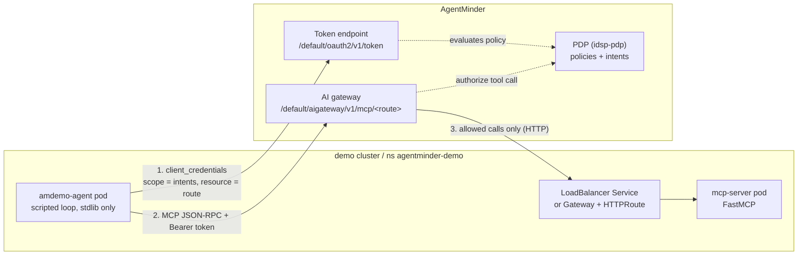
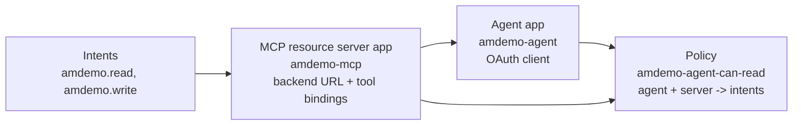
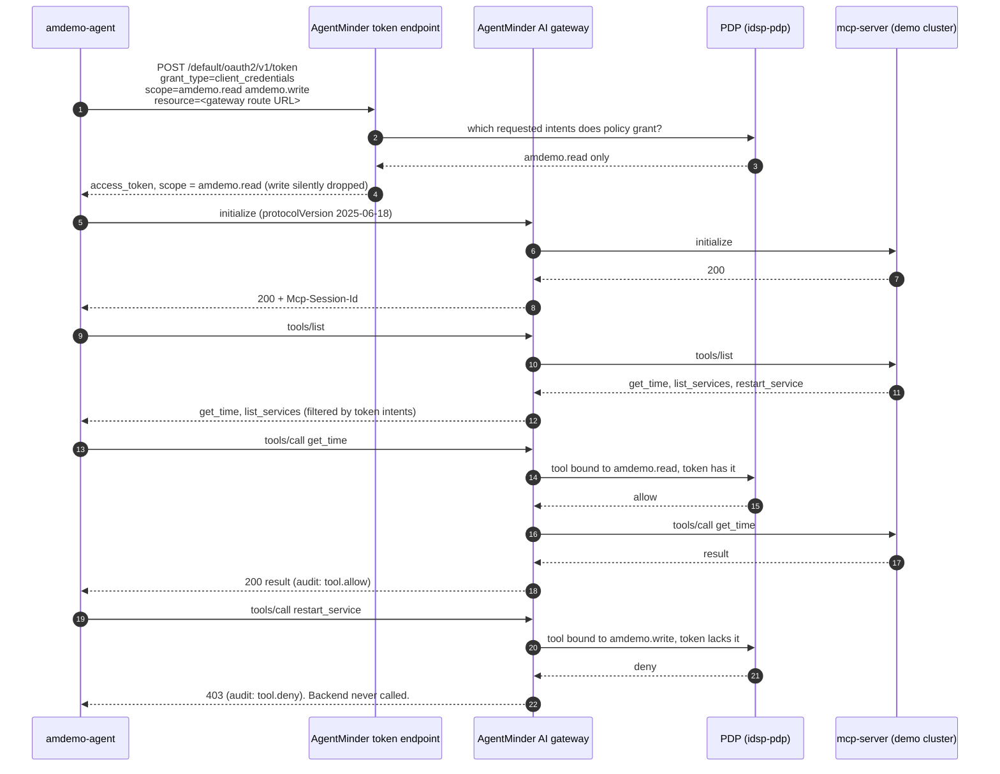

# How AgentMinder works, through the amdemo demo

AgentMinder decides, per tool call, whether an AI agent may use an MCP tool.
It sits in the request path as both the OAuth authorization server and an MCP
gateway, so the agent never talks to the MCP server directly. This demo shows
that loop with one scripted agent, one three-tool MCP server and one policy,
all deployed by a single `ansible-playbook site.yml` run.

What it shows, on AgentMinder `4.1.1`:

- The agent gets a token that carries only the **intents** a policy grants it.
- The gateway filters `tools/list` to the tools those intents cover, and
  blocks `tools/call` on the rest with HTTP 403.
- Changing the policy (granting or revoking `amdemo.write`) changes what the
  agent can do on its next token. The agent and the MCP server do not change.
- Every allow and deny is written to the gateway audit log with the agent,
  tool, intent and decision.

The agent has no LLM. Every 60 seconds it gets a token, lists tools, and calls
`get_time`, `list_services` and `restart_service`, so the allow/deny behavior
is easy to see.

## Contents

1. [Architecture](#architecture)
2. [Object model](#object-model)
3. [Runtime flow](#runtime-flow)
4. [Grant and revoke](#grant-and-revoke)
5. [Admin API used by the modules](#admin-api-used-by-the-modules)
6. [Automation](#automation)
7. [Networking](#networking)
8. [Security notes and gaps](#security-notes-and-gaps)

## Architecture



| Component | Where | What it does |
|---|---|---|
| `amdemo-agent` | demo cluster, `agentminder-demo` | Gets a token, speaks MCP to the gateway route, logs ALLOWED/DENIED per call. Knows only the token URL and gateway URL. |
| AgentMinder token endpoint | AgentMinder | Issues OAuth tokens. Puts only policy-granted intents in the token's `scope`. |
| AgentMinder AI gateway | AgentMinder | MCP proxy. Checks the token, filters `tools/list`, authorizes each `tools/call` against tool bindings and policy, forwards allowed calls. |
| `mcp-server` | demo cluster, `agentminder-demo` | Plain FastMCP server with three tools. Does no auth of its own. |
| LoadBalancer Service, or Gateway + HTTPRoute | demo cluster | Gives the MCP server an address the AgentMinder gateway can reach. |

The MCP server does not authenticate callers. All of the security is in the
AgentMinder gateway. Anything that can reach its address directly can call
the MCP server, so in a real deployment the backend should only accept
traffic from the gateway.

## Object model

AgentMinder needs four kinds of object for this demo. They depend on each
other in this order, which is also the order the playbook creates them:



### Intents

An intent is a named permission, stored in the tenant's intent catalog
(`/admin/v1/AgentIntentCatalog`). By itself it grants nothing. Its OAuth scope
form is `urn:iam:agent:intent:<name>`. The catalog `name` has no URN prefix.

| Intent | Risk | Covers |
|---|---|---|
| `amdemo.read` | normal | `get_time`, `list_services` |
| `amdemo.write` | elevated | `restart_service` |

### MCP resource server app

An app with `isResourceServerApp: true` and `isAiResourceServerApp: true`. It
represents one MCP backend and holds:

| Field | Demo value | Meaning |
|---|---|---|
| `mcpServerEndpoint` | `http://mcp.example.com/mcp` | Where the gateway forwards allowed calls |
| `primaryAudience` | the gateway route URL | Token audience for this server |
| `resourceServerScopes` | both intents, with risk | Intents this server understands |
| `agentToolBindings` | one entry per tool | Maps each MCP tool name to the intent that unlocks it |
| `enforcePolicies` | `true` | Gateway evaluates policy on each call |
| `protectedByDefault` | `true` | A tool with no binding cannot be called |
| `mcpRequireAccessToken` | `true` | `tools/call` needs a Bearer token |
| `mcpDiscoverRequireAccessToken` | `true` | `initialize` and `tools/list` need one too |
| `mcpRequireIntentToken` | `false` | Not using intent tokens or missions in this demo |
| `mcpIgnoreSslValidation` | `true` | Backend is plain HTTP anyway |

AgentMinder generates a gateway route for the app:
`https://agentminder.example.com/default/aigateway/v1/mcp/<base64(appId)>`,
base64 with the `=` padding removed. Agents connect to that URL, never to
`mcpServerEndpoint`.

Tool bindings look like this on the app:

```json
"agentToolBindings": [
  {"toolName": "get_time",        "intentScope": "urn:iam:agent:intent:amdemo.read",  "source": "MANUAL"},
  {"toolName": "list_services",   "intentScope": "urn:iam:agent:intent:amdemo.read",  "source": "MANUAL"},
  {"toolName": "restart_service", "intentScope": "urn:iam:agent:intent:amdemo.write", "source": "MANUAL"}
]
```

### Agent app

An app with `isAgentApp: true`. It is an OAuth confidential client that uses
the `client_credentials` grant. The fields that matter:

| Field | Demo value | Meaning |
|---|---|---|
| `agentDelegationMode` | `AUTONOMOUS` | Acts as itself, not on behalf of a user in a mission |
| `agentRiskLevel` | `standard` | Risk label, available to policy |
| `agentUseAllAllowedIntents` | `false` | Token carries only the intents requested **and** allowed |

An app has two IDs. `appId` is the internal ID that policies use. `clientId`
is the OAuth client ID the agent authenticates with. Mixing them up is the
easiest mistake to make with policies.

### Policy

A native `role` policy (`/admin/v1/AuthZPolicies`). It is scoped to one
resource server through `apps`, and one grant rule says which agents get which
intents:

```json
{
  "policyName": "amdemo-agent-can-read",
  "policySubType": "role",
  "status": "active",
  "matchAnyApp": false,
  "apps": [{"id": "<amdemo-mcp appId>", "name": "amdemo-mcp"}],
  "rules": [{
    "conditions": {"principal": {"clientApp": {"operator": "in", "value": ["<amdemo-agent appId>"]}}},
    "result": {"effect": "grant", "msg": "amdemo-agent-can-read",
               "privileges": ["urn:iam:agent:intent:amdemo.read"]}
  }]
}
```

Granting write access means adding `urn:iam:agent:intent:amdemo.write` to
`privileges`. Nothing else changes.

## Runtime flow

One agent cycle with the default policy (read only):



### 1. Token request

The agent asks for every intent it might need. The policy decides which ones
it gets:

```
POST https://agentminder.example.com/default/oauth2/v1/token
Authorization: Basic base64(clientId:clientSecret)
Content-Type: application/x-www-form-urlencoded

grant_type=client_credentials
&resource=https://agentminder.example.com/default/aigateway/v1/mcp/<route>
&scope=urn:iam:agent:intent:amdemo.read urn:iam:agent:intent:amdemo.write
```

Notes on this request:

- **`resource` (RFC 8707) is required.** Without it, any intent scope returns
  `400 invalid_request "Invalid scope"`. `audience=` does not work in its
  place. `resource` tells AgentMinder which resource server's policies apply.
- **Do not add `openid`** to the scope. The request fails again.
- **Intents the policy does not grant are dropped silently.** The request
  still succeeds, and the token's `scope` shows what was granted. The agent
  logs it as `granted scopes: urn:iam:agent:intent:amdemo.read urn:iam:m.meclient`.
- The token's `aud` is `[<gateway route URL>, https://agentminder.example.com/default/]`.

### 2. MCP session through the gateway

The agent speaks MCP over streamable HTTP (JSON-RPC in a POST body) to the
gateway route, with the token as a Bearer header.

- **The gateway only accepts MCP protocol versions `2025-06-18` and
  `2025-11-25`.** `2025-03-26` or `2024-11-05` returns HTTP 200 with a
  JSON-RPC error: `{"code":2003,"message":"AI Gateway: Backend does not
  support a compatible protocol version"}`. The message is misleading. The
  backend (`mcp` 1.30.0) accepts both older versions when called directly.
  Check the body for `error`, not just the HTTP status. The agent sends
  `2025-06-18` in `initialize` and in an `MCP-Protocol-Version` header; the
  header is optional on `initialize`.
- The gateway returns its own `Mcp-Session-Id`, a signed JWT that records the
  backend URL and capabilities. The agent sends it back on each later call.
- `notifications/initialized` returns `202`.

### 3. Filtered tool discovery

`tools/list` passes through to the backend, but the gateway removes tools the
token's intents do not cover. With read-only access the agent sees
`['get_time', 'list_services']`. `restart_service` is not listed at all.

### 4. Per-call authorization

For each `tools/call` the gateway looks up the tool's binding, takes the
bound intent, and asks the PDP whether this agent holds it for this resource
server.

- **Allow:** the call is forwarded to `mcpServerEndpoint` and the result is
  returned. Audit event `aigateway.mcp.tool.allow`.
- **Deny:** `403`, the backend is never called. Audit event
  `aigateway.mcp.tool.deny`.

The demo agent calls `restart_service` even though `tools/list` hid it. A real
agent would not, but the call proves the gateway enforces, not just hides.

Deny logs carry the reason from the PDP:

```
authorize: request denied for sub=<agent clientId> by PDP "idsp-pdp"
reason: Computed allowed scopes '[]' does not contain requested scopes: '[urn:iam:agent:intent:amdemo.write]'
MCP: tools/call request denied — Computed allowed scopes '[]' does not contain requested scopes: '[urn:iam:agent:intent:amdemo.write]' (policy "authorize")
MCP: tool call "restart_service" denied on backend "amdemo-mcp": policy/authorize
```

`authorize` is the gateway's own authorization step reporting "no policy
granted this". It is not a policy you created.

## Grant and revoke

Policy changes take effect on the agent's next token. The agent and the MCP
server are not touched. One cycle of the 60-second agent loop per row:

| Step | Policy grants | Token scope | `tools/list` | `restart_service` |
|---|---|---|---|---|
| start | `amdemo.read` | read | `get_time`, `list_services` | DENIED, HTTP 403 |
| grant `amdemo.write` | `amdemo.read`, `amdemo.write` | read + write | all three | ALLOWED, `restarted cache` |
| revoke `amdemo.write` | `amdemo.read` | read | `get_time`, `list_services` | DENIED, HTTP 403 |

To reproduce:

```bash
# grant write
ansible-playbook site.yml --tags agentminder \
  -e '{"granted_intents": ["amdemo.read", "amdemo.write"]}'

# revoke: re-run with the defaults
ansible-playbook site.yml --tags agentminder

# watch the agent
kubectl -n agentminder-demo logs deploy/amdemo-agent -f

# gateway audit trail, on the AgentMinder cluster (names depend on the install)
kubectl -n ssp logs deploy/ssp-ssp-aigateway -c ssp-aigateway --since=10m \
  | grep -E 'MCP: tool call|request denied'
```

The gateway logs JSON lines. The allow event after the grant shows the
intent that unlocked the call:

```json
{"msg": "MCP: tool call \"restart_service\" allowed on backend \"amdemo-mcp\"",
 "eventId": "aigateway.mcp.tool.allow",
 "relVersion": "4.1.1.1673",
 "idsp.policy.decision": "allow",
 "idsp.intent.scope": "urn:iam:agent:intent:amdemo.write",
 "idsp.intent.name": "amdemo.write",
 "gen_ai.agent.name": "amdemo-agent",
 "gen_ai.tool.name": "restart_service",
 "mcp.method.name": "tools/call",
 "mcp.protocol.version": "2025-06-18",
 "aigateway.mcp.duration": "3.516223ms"}
```

`relVersion` on every audit event is the quickest way to confirm which build
the gateway runs.

## Admin API used by the modules

All paths are under `https://agentminder.example.com/<tenant>`, here
`/default`.

### Authentication

`client_credentials` against `/oauth2/v1/token`, with HTTP Basic client auth
and these scopes:

```
urn:iam:t.apps urn:iam:t.authzpolicies urn:iam:t.aigateways
urn:iam:t.airesources urn:iam:t.airesourceservers
```

The scopes must be requested explicitly. A token request with no `scope`
succeeds but only carries `urn:iam:m.meclient`, not the admin scopes.

The client ID and secret come from `local.yml`
(`agentminder_client_id`, `agentminder_client_secret`), with the CA in
`agentminder_ca_file`. On a default install the tenant bootstrap client is in
secret `ssp-ssp-secret-defaulttenantclient` and the CA is `ca.crt` in secret
`ssp-ssp-tls`, both in namespace `ssp`. That CA is a bare self-signed cert,
so clients need `VERIFY_X509_PARTIAL_CHAIN` (Python) to trust it as an anchor.

### Endpoints

| Object | Call | Notes |
|---|---|---|
| Intent | `GET/POST /admin/v1/AgentIntentCatalog` | `name` without URN prefix. Bulk ops: `?op=bulkAdd\|bulkCheck\|bulkRemove` |
| Intent | `PUT/DELETE /admin/v1/AgentIntentCatalog/{agentIntentTypeId}` | |
| App | `GET /admin/v1/Apps` | Lists all apps, **including client secrets in plain text** |
| App | `POST /admin/v1/Apps` | Payload mirrors the console's `createApplication` (`apptype_agent` / `apptype_mcp_server` presets) |
| App | `GET /admin/v1/Apps/{appId}?resolveMetadataObjIds=true` | Full object |
| App | `PUT /admin/v1/Apps/{appId}?resolveMetadataObjIds=true` | Full-object replace. Drop `secret`, `createdBy`, `updatedBy`, `createdDateTime`, `updatedDateTime` first |
| App | `DELETE /admin/v1/Apps/{appId}?force=true` | |
| Tool bindings | `agentToolBindings` field on the app, written with the app `PUT` | Readable on its own via `AgentToolBindingsHelper?appId=` |
| Policy | `GET /admin/v1/AuthZPolicies?filter=(policyName eq <name>)` | |
| Policy | `POST /admin/v1/AuthZPolicies`, `PUT/DELETE .../{policyId}` | Server adds rule IDs; ignore them when comparing |
| Gateway routes | `GET .../AIGateways/groups/default/routes` (exact prefix not recorded) | Summaries only. `.../routes/{name}` returned 404 `Unknown gateway route` |

## Automation

One playbook, three custom modules, no images to build.

```
ansible/
  site.yml
    tasks/preflight.yml    check that the AgentMinder settings are present
    tasks/mcp_server.yml   MCP server + its exposure on the demo cluster
    tasks/agentminder.yml  intents -> resource server -> agent -> policy
    tasks/agent.yml        agent Secret, ConfigMap, Deployment
  teardown.yml             reverse of the above
  plugins/modules/         agentminder_intent, agentminder_app, agentminder_policy
  plugins/module_utils/    agentminder.py (shared admin API client)
  inventory/group_vars/all/defaults.yml, local.yml
app/                       agent.py, mcp_server.py
```

| Module | Manages | Notes |
|---|---|---|
| `agentminder_intent` | One catalog intent | |
| `agentminder_app` | `type: agent` or `type: mcp_server` | Creates with `POST`, then converges only the managed fields with a full-object `PUT`, then re-reads and fails if they did not converge. Returns `app_id`, `client_id`, `gateway_url`, optionally `client_secret` |
| `agentminder_policy` | One `role` policy with one grant rule | Takes app **names** and resolves them to `appId`s |

Design choices:

- **Standard library only.** The modules and the agent use `urllib`, so they
  need no extra Python packages. The MCP server installs `mcp>=1.12,<2` at
  pod start into `/tmp/deps`.
- **Idempotent with check mode.** Each module compares only what it manages,
  ignoring server-added keys and order. A second `site.yml` run reports
  `changed=0`.
- **Settings in one file.** The AgentMinder URL, admin client and CA are set
  in the git-ignored `local.yml`. The agent's client secret is returned by
  `agentminder_app` under `no_log` and goes into a Kubernetes Secret on the
  demo cluster.
- **Code from ConfigMaps.** Both pods run stock `python:3.12-slim` with the
  code mounted from a ConfigMap. They run as non-root with all capabilities
  dropped, so they pass Pod Security `restricted`. A checksum annotation restarts the pod when
  the code, config or credentials change.
- **Tags for the demo.** `--tags agentminder` re-runs only the registration,
  which is how the grant and revoke steps work.

## Networking

The AgentMinder gateway must reach the MCP server, so the MCP server needs an
address that is routable and resolvable from wherever AgentMinder runs.
`mcp_expose` picks how:

- `loadbalancer` (default): a `LoadBalancer` Service. The playbook waits for
  its address and registers `http://<address>/mcp`.
- `gateway`: a Gateway API `Gateway` and `HTTPRoute`. The playbook waits for
  the Gateway address, sets a hostname on the listener and route
  (`mcp_hostname`, or an `sslip.io` name derived from the address), and
  registers `http://<hostname>/mcp`.
- `clusterip`: no external address. Only for AgentMinder on the same cluster.

The agent needs no inbound path. It only calls the AgentMinder URL.

For Avi (AKO) with Istio, see [avi-ako-notes.md](avi-ako-notes.md).

## Security notes and gaps

- **The admin client is effectively a master key.** `GET /admin/v1/Apps`
  returns every app's client secret in plain text. The demo uses the tenant
  bootstrap client, kept in a git-ignored file. A dedicated, narrowly scoped
  admin client would be better.
- **The MCP backend is unauthenticated.** The gateway enforces policy, but
  its load balancer address is reachable directly. Restrict the backend to gateway traffic
  in anything beyond a demo.
- **Backend traffic is plain HTTP** from the gateway to the MCP server
  address (`mcpIgnoreSslValidation: true`).
- **Not covered:** missions and delegated agents
  (`agentDelegationMode` other than `AUTONOMOUS`), intent tokens
  (`mcpRequireIntentToken`), DPoP, and an LLM-driven agent.
- **Agent apps differ slightly from console-created ones.** The console sets
  `allowedOperations: [introspect]`, `userInfoEndpointResponseFormat:
  PLAIN_JSON` and `skipIssuerAudienceForIT: true`. The demo does not need
  them.
